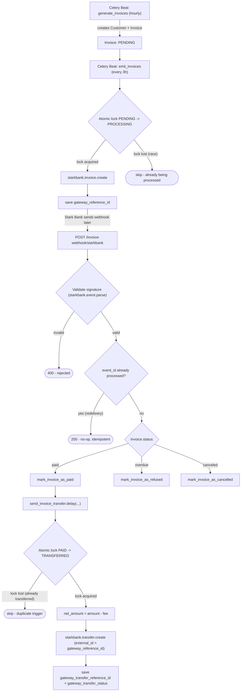

# Starkbank challenge

Stark Bank backend developer challenge, made to evaluate the skills to join the great house of the north.

## Requirements

- Docker and Docker Compose (`docker compose` plugin)
- `make`

## Setup

Create the `.env` file from the example:

```bash
cp .env.example .env
```

### Environment variables

| Variable | Description |
|---|---|
| `SECRET_KEY` | Django secret key. |
| `DEBUG` | Django debug mode. |
| `ALLOWED_HOSTS` | Comma-separated list of allowed hosts. Already includes the ngrok domains needed for the webhook tunnel (see below). |
| `CELERY_BROKER_URL` / `CELERY_RESULT_BACKEND` | Redis connection used by Celery. |
| `STARKBANK_KEY` | Private key (EC) of your Stark Bank Sandbox Project. |
| `STARKBANK_PROJECT_ID` | Stark Bank Sandbox Project ID. |
| `STARKBANK_ENVIRONMENT` | Stark Bank environment (`sandbox` or `production`). |
| `NGROK_AUTHTOKEN` | ngrok authtoken, used to expose the local webhook endpoint (free account, see [ngrok.com](https://ngrok.com)). |

`STARKBANK_KEY`/`STARKBANK_PROJECT_ID` come from a Project created in your Stark Bank Sandbox account. Never commit real values — only `.env.example` is tracked, with placeholders.

## Webhook

The app exposes an invoice webhook endpoint at `/invoice-webhook/starkbank`, which validates the Stark Bank signature, deduplicates redelivered events, and reacts to `paid`/`overdue`/`canceled` invoice statuses (marking the invoice accordingly and, when paid, sending the net amount via a Transfer).

For local development, `docker compose up` also starts an `ngrok` tunnel and a one-shot `webhook-registrar` service that automatically discovers the tunnel's public URL and registers/updates it as a Webhook on your Stark Bank Sandbox Project — no manual step required. This only needs `NGROK_AUTHTOKEN` set in `.env`.

## Commands

```bash
make build            # build the images
make up               # start the services (web, redis, celery-worker, celery-beat)
make up-d             # start the services in the background
make down             # stop the services
make logs             # follow the logs

make migrate          # apply migrations
make makemigrations   # generate new migrations
make createsuperuser  # create a superuser for admin access
make check            # run Django's system check
make shell            # open the Django shell
make format           # format files
make test             # run the tests
```

The application is available at `http://localhost:8000`.

## Process overview



**Focal points**

- **Atomic lock on emission** (`PENDING -> PROCESSING`): prevents the same invoice from being sent to Stark Bank twice if the periodic task and a manual admin action overlap.
- **Webhook signature validation**: every request is verified against the Stark Bank public key before any processing; invalid signatures are rejected with `400` and never reach business logic.
- **Idempotency by `event_id`**: Stark Bank may redeliver the same webhook event; a unique `event_id` (with a savepoint around the insert) guarantees a redelivered event is a no-op.
- **Atomic lock on transfer** (`PAID -> TRANSFERRED`): guarantees the net-amount Transfer is triggered at most once per invoice, even if two events point to the same invoice as paid.
- **`external_id` on the Transfer**: on top of the local lock, Stark Bank's own API deduplicates transfers by `external_id = gateway_reference_id`, adding a second, independent safety net.


## Manual processing (extra)

Besides the automated 3-hour cycle, invoices can be created and issued manually through the Django admin:

1. **Create a Customer** — `Starkbank_app > Customers > Add customer`, filling in `fullname` and `document`. The `document` field validates the CPF format on save (same `validate-docbr` check used by `generate_invoices`) — an invalid CPF is rejected before the Customer is created.
2. **Create an Invoice** — `Starkbank_app > Invoices > Add invoice`, selecting the `Customer` created above and the `amount` (in cents). Leave `status` as the default (`Pending`) and `gateway_reference_id`/`gateway_transfer_*` fields empty — they are only filled once the invoice is actually issued/paid/transferred.
3. **Issue it** — select the invoice in the list and run either the `Emit selected invoices` or `Emit all pending invoices` action.

**Premise: the invoice must be in `Pending` status for the emission actions to have any effect.** Both actions run the same `emit_invoices` task, which only ever picks up invoices filtered by `status=Pending`:

- `Emit selected invoices` silently ignores any selected invoice that isn't `Pending` (it's excluded from the queryset before the task runs) — no error, no message, it just won't be sent.
- `Emit all pending invoices` ignores the selection entirely and always operates on `Pending` invoices across the whole table (up to a random 8-12 batch, same as the periodic task).

This is intentional: once an invoice moves past `Pending` (`Processing`, `Paid`, `Transferred`, `Refused` or `Canceled`), it has either already been sent to Stark Bank or reached a terminal state — re-emitting it would risk creating a duplicate Invoice on the Sandbox.
